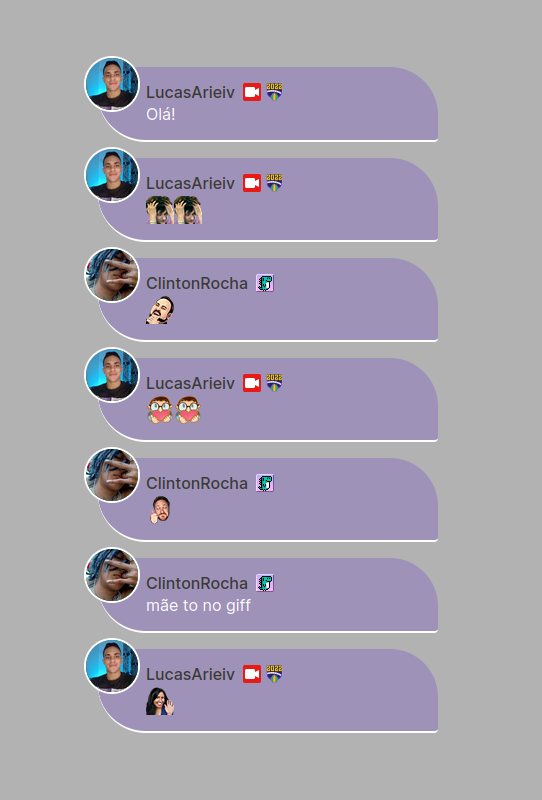

# Chat overlay
---

  

## TODO
- [x] Layout do overlay no figma
- [x] Implementação do Layout
- [x] Emojis não funcionam. Consultar API do Twitch para achar uma 
solução
- [x] Pegando Badges dos usuários
- [x] Função de cache para limpar chat
- [ ] Comandos estilização do Chat
  - [ ] !themes dark | light | default
- [ ] Chat styles
  - [ ] Criação de 3 temas para o overlay
- [ ] Passar projeto para Vuejs3
- [ ] Animação do overlay quando o usuário mandar mensagem no chat
- [ ] Função para o usuário escolher tema
- [ ] Armazenamento das opções do usuário

## Como utilizar
---
[Baixe](https://github.com/tmijs/tmi.js/releases) o arquivo da Lib do [tmi.js](https://github.com/tmijs/tmi.js/releases) e coloque na raiz do projeto.